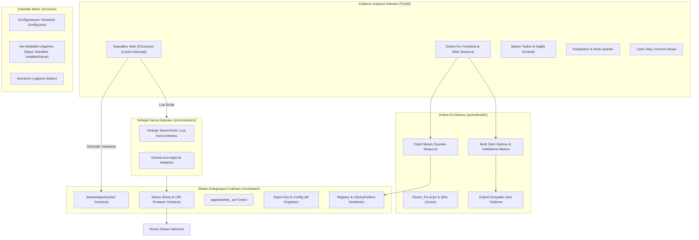

# STDP - Steam Tool Depotbox & Online-Fix Pipeline
## Kapsamlı Sistem Mimarisi Dokümantasyonu (ARCHITECTURE.md)

Bu doküman, **STDP (Steam Tool Depotbox & Online-Fix Pipeline)** projesinin teknik mimarisini, bileşen sorumluluklarını, veri akışlarını ve sistem entegrasyonlarını tanımlar.

---

## 1. Proje Vizyonu ve Temel İlkeler

1. **Tam Bağımsızlık (Self-Contained / All-in-One):**
   - Son kullanıcı üçüncü parti harici yazılımlar kurmak veya aramak zorunda değildir.
   - İhtiyaç duyulan kanca (hook) ve Lua çalıştırma motoru uygulamanın içinde yerleşik (embedded) olarak barındırılır.
2. **DepotBox Web Entegrasyonu & 1-Tıkla İndirme Yakalama:**
   - Dahili Chromium motoru ile `depotbox.org` üzerindeki tüm indirmeler otomatik yakalanır, şifre/manifestler çözümlenir ve Steam'e işlenir.
3. **Online-Fix.me Steam_Fix Otomasyonu:**
   - Çok oyunculu (multiplayer / co-op) online oyunlar için `online-fix.me` üzerindeki Steam_Fix paketleri şifresi (`online-fix.me`) otomatik çözülerek yüklü Steam oyun klasörlerine 1-tıkla kurulur.
   - Orijinal oyun dosyaları otomatik `.stdp_fix_backup` içine yedeklenir ve tek tıkla geri alınabilir (Revert).
4. **"Kur ve Unut" (Set & Forget):**
   - Uygulama manifest ve kilit betiklerini Steam'e yerleştirdikten sonra tamamen kapatılabilir. Oyunlar Steam kütüphanesinde kalıcıdır.

---

## 2. Yüksek Seviye Sistem Mimarisi

---

## 3. Katman ve Modül Sorumlulukları

### A. DepotBox Web Tarayıcısı (`src/ui/browser_view.py`)
- Dahili Chromium motoru, kalıcı oturum profili ve çerez yöneticisi.
- `depotbox.org` üzerinden başlatılan `.zip` indirmelerini otomatik yakalar.
- ZIP içerisindeki `.manifest` dosyalarını `Steam/depotcache/` klasörüne, `.lua` kilit dosyalarını `st_scripts/` klasörüne yazar.
- Seçilen hedef Steam kütüphanesine `appmanifest_<appid>.acf` oluşturur.

### B. Online-Fix Steam_Fix Yöneticisi (`src/onlinefix/`, `src/ui/onlinefix_view.py`)
- **`installer.py`**:
  - `scan_installed_games()`: Tüm Steam kütüphanelerindeki (`libraryfolders.vdf` -> `common/*`) oyunları ve fix durumlarını listeler.
  - `extract_archive()`: Şifreli (`online-fix.me`) `.zip`, `.rar`, `.7z` arşivlerini çözer.
  - `analyze_fix_archive()`: Arşiv içeriğini inceler, oyun adını ve DLL'leri eşler.
  - `install_fix()`: Orijinal `steam_api64.dll` gibi dosyaları `.stdp_fix_backup` içerisine yedekler, fix dosyalarını yerleştirir ve `OnlineFix.ini` yapılandırmasını (Nickname, Language) tamamlar.
  - `revert_fix()`: Fix dosyalarını silip orijinal yedekleri geri yükler.

### C. Steam Entegrasyon Katmanı (`src/steam/`)
- Windows Registry ve `libraryfolders.vdf` üzerinden çoklu disk ve boş alan tespiti.
- `depotcache` manifest yerleşimi ve `appmanifest_<appid>.acf` üretimi.
- Steam süreç kontrolü (`-shutdown`, başlatma ve `steam://` protokolleri).

### D. Yerleşik Kilit Açıcı Katmanı (`src/unlockers/`)
- SteamTools / Lua kanca motoru (`st_scripts/<appid>.lua`) ve opsiyonel GreenLuma AppList desteği.
